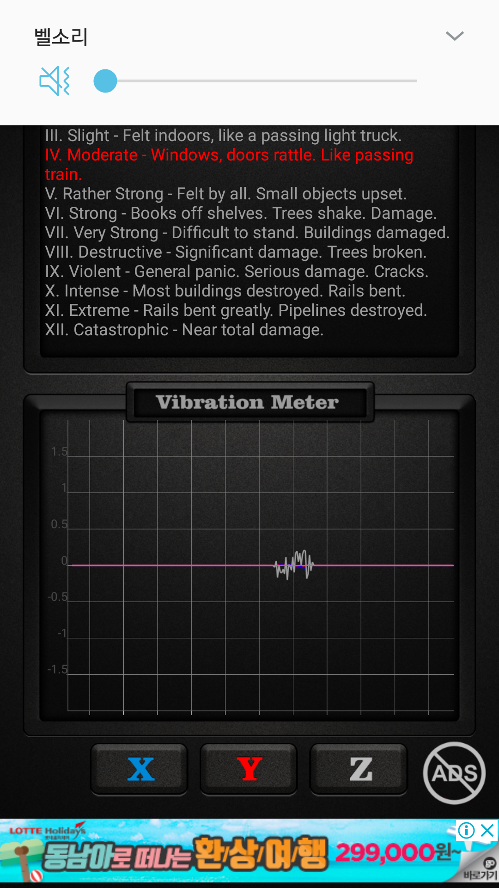
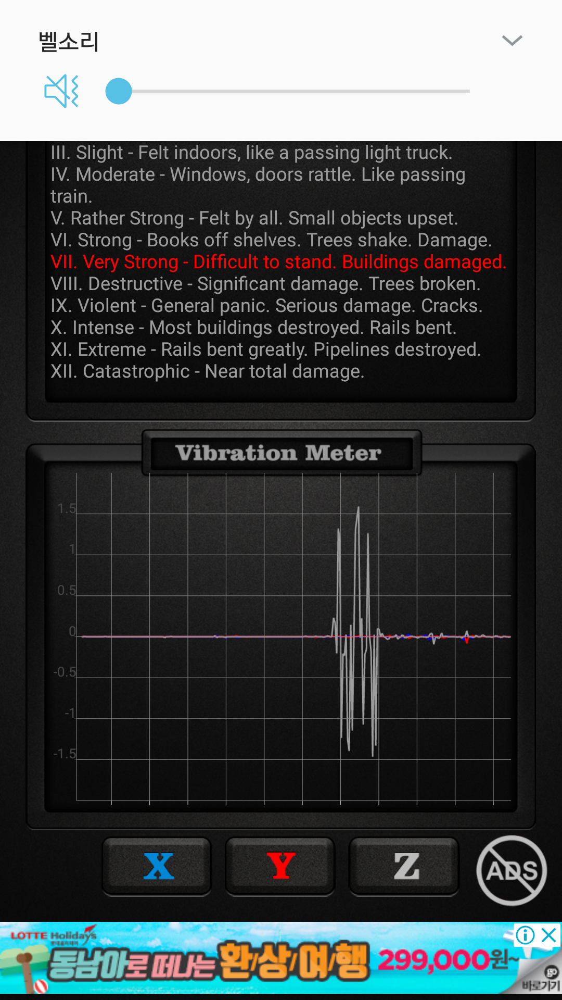
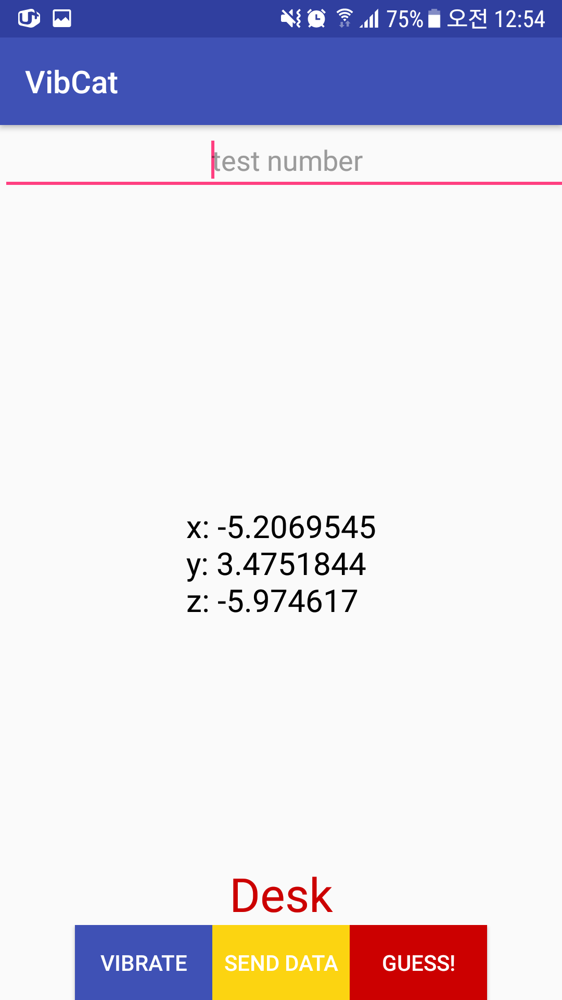
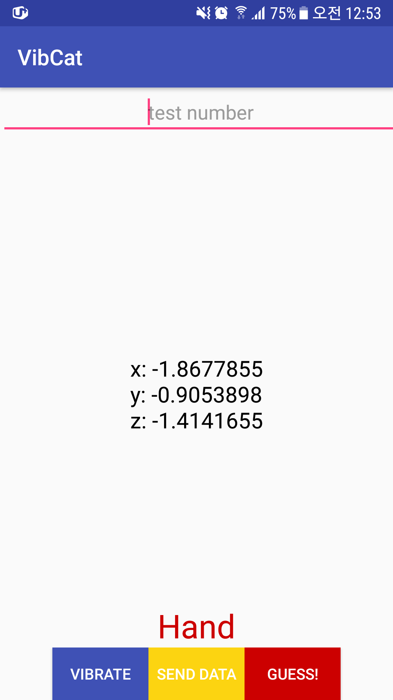

# VibCat : Vibration Categorization for Input & Interaction

----
## VibCat?
The name VibCat is inspired by [RadarCat](https://sachi.cs.st-andrews.ac.uk/research/interaction/radarcat-exploits-googles-soli-radar-sensor-for-object-and-material-recognition/) : _Radar Categorization for Input & Interaction_ of st-andrews' HCI research group. The __VibCat__ is _'Vibration Categorization for Input & Interaction'_.

----
## How it works
When our smartphone ringing(this case vibrating in silent mode), We can hear different vibrating sound. This because of rigidity of object. I use accelerometer on usual smart phone and measure the value. The different amplitudes are observed in different objects. 
 
### Vibration on the desk

### Vibration on the Hand

----
## Machine learning
# Data preprocessing
# SVM training

----
## Result
# Accuracy
# Classification
 
### VibCat for the desk

### VibCat for the hand

----
## Future work
* This project is underway from 04-Nov-2017
* Each object has its Natural frequency. Using this, making accurate object recognition.
* [ViBand](https://dl.acm.org/citation.cfm?id=2984582)

